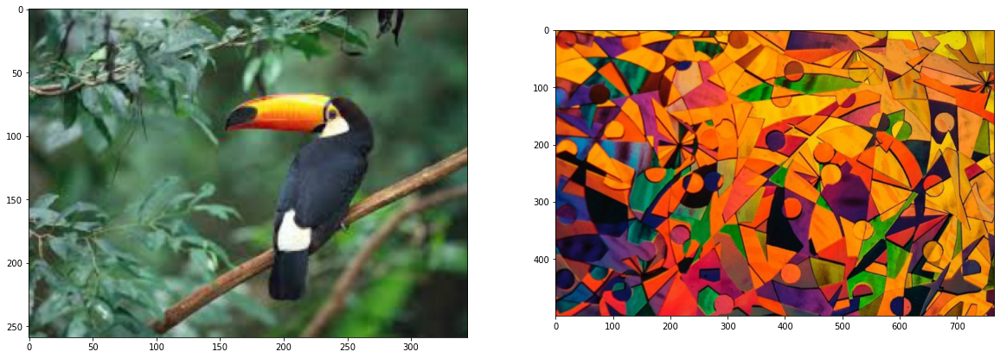
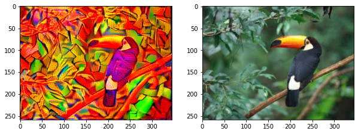

# Neural Style Transfer Using PyTorch

Neural Style Transfer (NST) is a deep learning technique that allows us to blend the content of one image with the artistic style of another image. It uses convolutional neural networks (CNNs) to extract content and style features from input images and then generates a new image that combines these features in a visually pleasing way. NST has applications in art, image editing, and creative content generation.

## Key Concepts

- Content Image: The image whose content we want to preserve in the final result.
- Style Image: The image whose artistic style we want to apply to the content image.
- Feature Extraction: Using a pre-trained CNN (e.g., VGG16) to extract content and style features from images.
- Loss Functions: Defining content and style loss functions to measure the difference between generated and target features.
- Gradient Descent: Optimizing the generated image to minimize the combined content and style losses.

## Methodology

1. Data Preparation: Load and preprocess content and style images for neural style transfer.

2. Feature Extraction: Utilize a pre-trained CNN (e.g., VGG16) to extract content and style features from images.

3. Loss Functions: Define content and style loss functions to measure the similarity between generated and target features.

4. Optimization: Use gradient descent to optimize a generated image to minimize the combined content and style losses.

## Results 

Artistic images are generated through neural style transfer, highlighting the unique combinations of content and style. These results will illustrate the power and creativity of this deep learning technique.

Before -

<kbd>

</kbd>

After - 

<kbd>

</kbd>

